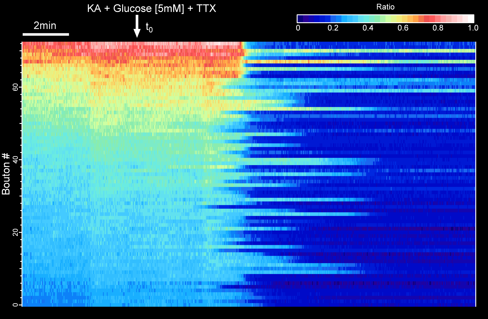
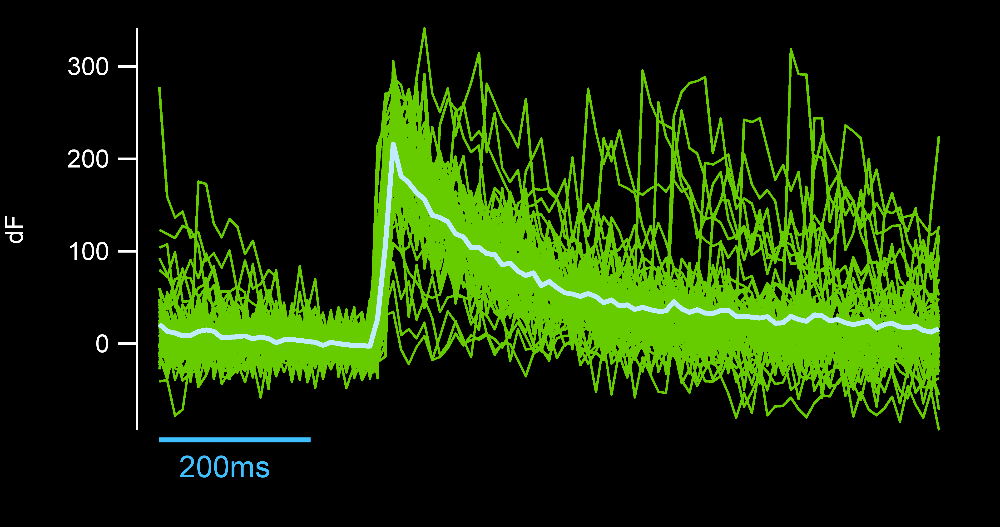

### Portfolio
---

#  Hello! [Please Visit my new website!](https://sites.google.com/view/camilapulido-phd/). It has more details about me and my work!

## Image Processing and Analysis:

### [I. Unraveling Neuronal Energetics: A protocol for Data Collection, Analysis, and Visualization within Neuronal Synapses](https://github.com/camilapulido/Neuron-Energy-Consumption/blob/8c056a62b64110fce80cabc4d166f52beb9cdd9e/README.md)

Neuronal images collected with the recently [published](https://doi.org/10.1101/2023.08.24.554624) ATP biosensor, iATPSnFR2.

     
      

    
          

### [II. Automatic detection of Spontaneous Synaptic Activity by the use of the glutamate sensor iGlusnFr](https://github.com/camilapulido/Automatic-Detection-of-spontaneus-activity-with-iGluSnFR/blob/3f3e0ec387952cec4073a0a04a154fc3f44047f5/README.md)

    

   

    

 

    

 

---
## Computational Modeling:

### [III. Computational Modeling to predict different short-term synaptic plasticity patterns](https://doi.org/10.1085/jgp.201812072)

---

Page template forked from <a href="https://github.com/evanca/quick-portfolio">evanca</a>

<!-- Remove above link if you don't want to attibute -->
